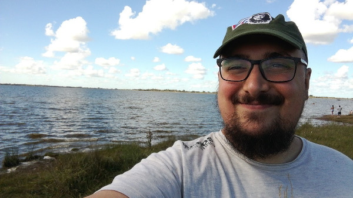

# Presentación

## Docente: ALF (Alfredo Sanzo)

Soy Alf, me gusta abrazar, programar, aprender, enseñar. Abrazo a la gente con quien programo, aprendo y enseño, intento aprender a programar, enseñar y aprender mejor, en mis trabajos programo herramientas para enseñar y aprender, y me gustaría mejorar en todo, por lo que sigo estudiando aunque todavía tampoco sea muy bueno en eso. 

Me gusta mucho Linux, juego al Age Of Empires 2 como si jugara al Sim City, y si sale un Among me prendo.

